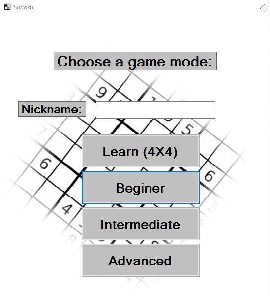
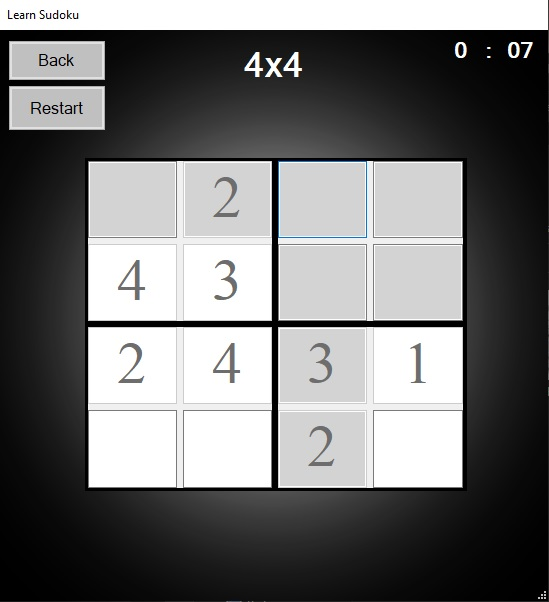
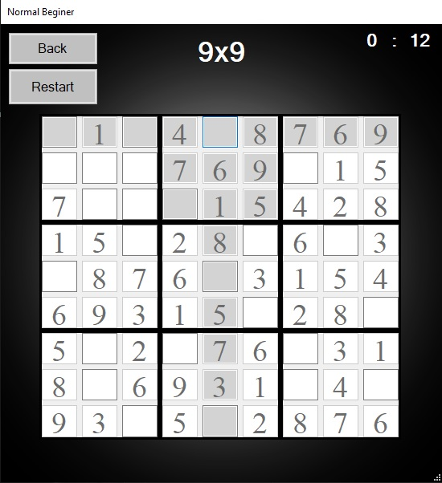
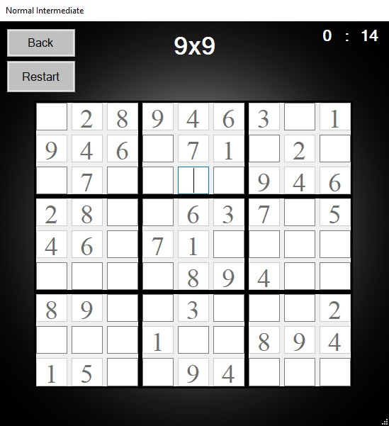
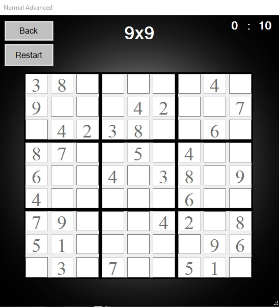

# Sudoku
- This project is an implementation of the game Sudoku in C# using Visual Studio.
- It was created by me for my professional certificate at the end of high school, CNI "Grigore Moisil" Brasov.
- The file <a href="DocumentatieSudoku.pdf"> DocumentatieSudoku.pdf </a> is a documentation for the app written in Romanian.

The picture below represents the main window for the app. The app has a TextBox to add the user nickname and 4 buttons:
1. Learn (4x4): which leads to the learn window; Learn is a version of sudoku in a 4x4 matrix
1. Beginer: which leads to the beginer window, a 9x9 matrix and with a huge number of completed boxes and a hint like in Learn version
1. Intermediate: like Beginer, but without the hint and with a smaller number of completed boxes
1. Advanced: like Intermediate, but with a much smaller number of completed boxes

- Learn version offers the user a little help: when a box is selected, the corresponding line, column and rectangular boxes are highlighted.

- Beginer version is a 9x9 sudoku with the little help from Learn version.

- Intermediate and Advanced version are the regular sudoku, the difference being made by the number of completed boxes.

- Advanced

